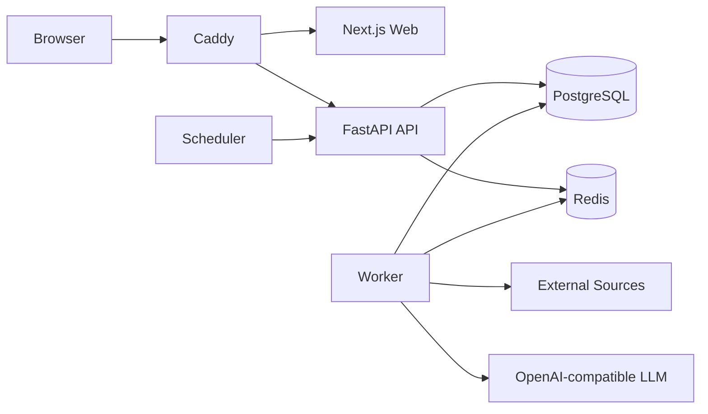

# Daily News

[Simplified Chinese](README.md) | [English](README.en.md)

[](https://github.com/ZJM189/Daily_News/actions/workflows/ci.yml)
[](api/pyproject.toml)
[](web/package.json)
[](https://github.com/ZJM189/Daily_News/stargazers)
[](https://github.com/ZJM189/Daily_News/network/members)
[](https://github.com/ZJM189/Daily_News/issues)
[](https://github.com/ZJM189/Daily_News/commits/main/)
[](https://github.com/ZJM189/Daily_News)

Daily News is a multi-user web dashboard for AI news intelligence. It collects content from multiple sources, normalizes and scores items, groups topics, generates Chinese summaries, classifies source rules, and publishes browsable daily AI briefings.

The project is designed for single-server deployment with Docker Compose, running the web app, API, database, cache, background worker, scheduler, and reverse proxy together.

## Features

- Multi-source collection: RSS, Hacker News, GitHub, arXiv, Product Hunt, and Hugging Face.
- AI content pipeline: normalization, relevance scoring, topic aggregation, Chinese summaries, source rule classification, and daily digest generation.
- Multi-provider LLM support: OpenAI-compatible providers such as OpenAI, DeepSeek, and Qwen-compatible services.
- Multi-user accounts: no public registration; administrators create users, disable users, and reset passwords.
- Personalized following: soft weighting for followed keywords, hard filtering for excluded keywords, category and source-type filters, blocked sources, and saved searches.
- Private favorites: save items from the library, item detail panel, and following feed; organize favorites with single-level folders, move items, search, paginate, and move entries back to root when deleting a folder.
- Dynamic library analytics: collapsible analytics panel for collection trends, source distribution, category distribution, score distribution, and summary coverage.
- Library chat assistant: a global floating chat widget built on assistant-ui core primitives for natural-language queries over stored AI content, with intent gating, a DeepAgents read-only database tool, SSE streaming, and per-user chat history.
- Consistent web workspace: sidebar, page headers, cards, metrics, alerts, pagination, and tables use a unified admin-dashboard style.
- Web pages: daily digest, history, library, following feed, favorites, job logs, user management, source management, LLM management, and scheduler management.
- Public deployment: Caddy is the single public entry point; API and Web are served under the same origin.

## Tech Stack

| Module | Technology |
| --- | --- |
| Frontend | Next.js App Router, React, TypeScript, assistant-ui core primitives, shadcn-style local UI primitives, Apache ECharts, TanStack Table, lucide-react |
| Backend | FastAPI, Python 3.12, DeepAgents |
| Architecture | DDD-style modular monolith |
| Database | PostgreSQL |
| Cache / task state | Redis |
| Scheduler | APScheduler |
| Deployment | Docker Compose, Caddy |

## Quick Start

```bash
cp .env.example .env
docker compose up --build -d
docker compose exec api alembic upgrade head
docker compose exec api daily-news create-admin
```

Local URLs:

```text
http://localhost
http://localhost/api/v1/healthz
```

If you do not have a domain yet, use the server public IP. Keep the real address only in the server-side `.env` file and do not commit it:

```dotenv
APP_ENV=production
APP_DOMAIN=your-server-ip
APP_EXTERNAL_URL=http://your-server-ip
CADDYFILE_PATH=./infra/caddy/Caddyfile
HTTP_PORT=8181
SESSION_COOKIE_SECURE=false
NEXT_PUBLIC_API_BASE_URL=/api/v1
```

Replace `your-server-ip` with the actual public IP, then visit `http://your-server-ip:8181`.

## LLM Setup

LLM providers are configured in the admin console:

```text
/admin/llm
```

Example provider:

```text
Name: DeepSeek
Base URL: https://api.deepseek.com/v1
Model: deepseek-chat
API Key: your API key
Enabled: yes
Default: yes
```

Summary jobs use the enabled default provider.

## Main Pages

| Path | Description |
| --- | --- |
| `/login` | User login |
| `/today` | Today's AI digest |
| `/history` | Browse historical digests by date |
| `/library` | Full content library search, collapsible analytics, filters, list, and detail panel |
| `/following` | Personalized following feed, preference card, active rule preview, and feedback |
| `/favorites` | Private favorites with folders, search filters, move, and unfavorite actions |
| `/admin/users` | Admin user creation, disablement, and password reset |
| `/admin/sources` | Source and credential management |
| `/admin/llm` | LLM provider management |
| `/admin/jobs` | Job log table, progress view, metrics cards, and one-click full pipeline trigger |
| `/admin/scheduler` | Daily digest scheduler configuration |

## Architecture



Container responsibilities:

- `web`: Next.js frontend.
- `api`: FastAPI HTTP API.
- `worker`: runs background jobs for collection, normalization, scoring, aggregation, summarization, and digest generation.
- `scheduler`: triggers the daily processing chain according to scheduler configuration.
- `postgres`: primary database.
- `redis`: task state and future async infrastructure.
- `caddy`: public reverse proxy and HTTPS entry point.

## Backend Structure

```text
api/app/
├── domain/          # Domain objects, domain exceptions, domain events
├── application/     # Application services, DTOs, repository protocols, use-case orchestration
├── infrastructure/  # Database models, repository implementations, external collectors, LLM clients
└── interfaces/      # HTTP routes, CLI, Worker, Scheduler
```

## Production Deployment

With a domain, use the HTTPS production Caddy configuration:

```dotenv
APP_ENV=production
APP_DOMAIN=news.example.com
APP_EXTERNAL_URL=https://news.example.com
CADDYFILE_PATH=./infra/caddy/Caddyfile.production
CADDY_ACME_EMAIL=admin@example.com
SESSION_COOKIE_SECURE=true
NEXT_PUBLIC_API_BASE_URL=/api/v1
```

Start services:

```bash
docker compose build
docker compose up -d
docker compose exec api alembic upgrade head
docker compose exec api daily-news create-admin
```

Replace all default production secrets in `.env`:

- `POSTGRES_PASSWORD`
- `SESSION_SECRET`
- `CSRF_SECRET`
- `ENCRYPTION_KEY`

Generate `ENCRYPTION_KEY`:

```bash
docker compose run --rm api python -c "from cryptography.fernet import Fernet; print(Fernet.generate_key().decode())"
```

See [Deployment](docs/deployment.md) and [Operations](docs/operations.md) for full details.

## Common Commands

```bash
# Check services
docker compose ps

# View logs
docker compose logs --tail=100 api
docker compose logs --tail=100 worker
docker compose logs --tail=100 scheduler

# Run database migrations
docker compose exec api alembic upgrade head

# Create an admin user
docker compose exec api daily-news create-admin

# Health check
curl -f http://127.0.0.1:8181/api/v1/healthz
```

Manual daily pipeline verification: log in as an administrator, open `/admin/jobs`, and click the full pipeline action. The system creates `collect -> normalize -> rank -> dedupe -> summarize -> generate_digest` jobs, and the worker consumes them in order.

## Backup

```bash
mkdir -p backups
docker compose exec -T postgres pg_dump -U daily_news -d daily_news -Fc > backups/daily_news_$(date +%Y%m%d_%H%M%S).dump
```

See [Operations](docs/operations.md) for restore steps.

## Development Verification

Favorite feature rules are documented in [Favorites Design](docs/product/favorites.md). The database migration is `202609060001`. When upgrading an existing environment, run `docker compose exec api alembic upgrade head` before starting the new Web container.

PostgreSQL integration tests and desktop/mobile browser E2E tests for favorites are documented in [Favorites Testing](docs/testing/favorites.md).

Backend:

```bash
cd api
. .venv/bin/activate
ruff check app tests
pytest -q
```

Frontend:

```bash
cd web
npm run build
```

## 📄 License

Original code in this project is licensed under the MIT License. The macshot-derived screenshot module needs a separate license and provenance review. Do not assume the combined application is MIT-only. See [THIRD_PARTY_NOTICES.md](THIRD_PARTY_NOTICES.md).

## ⭐ Star History

[](https://www.star-history.com/#ZJM189/Daily_News&Date)
