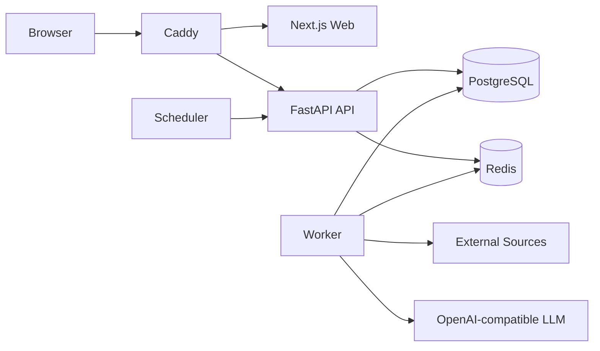

# Daily News

[简体中文](README.md) | [English](README.en.md)

[](https://github.com/ZJM189/Daily_News/actions/workflows/ci.yml)
[](https://github.com/ZJM189/Daily_News/stargazers)
[](https://github.com/ZJM189/Daily_News/network/members)
[](https://github.com/ZJM189/Daily_News/issues)
[](https://github.com/ZJM189/Daily_News/commits/main/)
[](https://github.com/ZJM189/Daily_News)

Daily News 是一个面向 AI 热点信息的多用户 Web 看板，用于自动采集多来源内容，完成标准化、评分、专题聚合、中文摘要和来源规则分类，并按天生成可浏览的 AI 情报简报。

项目适合部署在单台云服务器上，通过 Docker Compose 启动前端、后端、数据库、缓存、后台任务、定时调度和反向代理。

## 功能特性

- 多来源采集：RSS、Hacker News、GitHub、arXiv、Product Hunt、Hugging Face。
- AI 内容处理：标准化、热度评分、专题聚合、中文摘要、来源规则分类、每日简报生成。
- 多厂商 LLM：支持 OpenAI-compatible 接口，可配置 OpenAI、DeepSeek、通义千问等兼容服务。
- 多用户账号：不开放公开注册，只允许管理员创建用户、禁用用户和重置密码。
- 个性化关注：关注关键词软加权，排除关键词硬过滤，支持分类、来源类型、屏蔽来源和保存搜索。
- 私有收藏：信息库、条目详情和关注流支持收藏，提供单层目录、移动、检索分页及删除目录后移回根目录。
- 动态数据洞察：信息库支持折叠数据大屏、入库趋势、来源分布、分类分布、分数分布和摘要覆盖率统计。
- 框架化 Web UI：侧边栏、页面标题、卡片、指标、提示、分页和表格使用统一的后台组件风格。
- Web 工作台：今日简报、历史简报、信息库、我的关注、任务日志、用户管理、来源管理、LLM 管理、调度管理。
- 外公网部署：Caddy 作为统一入口，对外只暴露 HTTP/HTTPS，API 和 Web 使用同源路径。

## 技术栈

| 模块 | 技术 |
| --- | --- |
| 前端 | Next.js App Router, React, TypeScript, shadcn-style local UI primitives, Apache ECharts, TanStack Table, lucide-react |
| 后端 | FastAPI, Python 3.12 |
| 架构 | DDD 风格模块化单体 |
| 数据库 | PostgreSQL |
| 缓存/任务状态 | Redis |
| 调度 | APScheduler |
| 部署 | Docker Compose, Caddy |

## 快速启动

```bash
cp .env.example .env
docker compose up --build -d
docker compose exec api alembic upgrade head
docker compose exec api daily-news create-admin
```

本地访问：

```text
http://localhost
http://localhost/api/v1/healthz
```

如果暂时没有域名，可以使用服务器公网 IP 访问。请将实际地址只配置在服务器上的 `.env` 文件中，不要提交到代码仓库：

```dotenv
APP_ENV=production
APP_DOMAIN=your-server-ip
APP_EXTERNAL_URL=http://your-server-ip
CADDYFILE_PATH=./infra/caddy/Caddyfile
HTTP_PORT=8181
SESSION_COOKIE_SECURE=false
NEXT_PUBLIC_API_BASE_URL=/api/v1
```

然后将 `your-server-ip` 替换为实际公网 IP，再访问 `http://your-server-ip:8181`。

## LLM 配置

LLM Provider 通过管理员后台配置：

```text
/admin/llm
```

新增 Provider 时填写：

```text
名称：DeepSeek
Base URL：https://api.deepseek.com/v1
模型：deepseek-chat
API Key：你的 API Key
启用：是
设为默认：是
```

当前摘要任务会使用“启用且默认”的 Provider。

## 主要页面

| 路径 | 说明 |
| --- | --- |
| `/login` | 用户登录 |
| `/today` | 今日 AI 简报 |
| `/history` | 按日期查看历史简报 |
| `/library` | 全量信息库检索、折叠数据大屏、筛选卡片、列表和详情面板 |
| `/following` | 个性化关注流、偏好配置卡片、生效规则预览和反馈 |
| `/favorites` | 我的收藏，按目录查看、搜索筛选、移动与取消收藏 |
| `/admin/users` | 管理员创建用户、禁用用户、重置密码，采用表单卡片和数据表卡片 |
| `/admin/sources` | 数据源和凭据管理，采用表单卡片和数据表卡片 |
| `/admin/llm` | LLM Provider 管理，采用表单卡片和 Provider 表格 |
| `/admin/jobs` | TanStack Table 任务日志、进度查看、指标卡和一键触发完整处理链路 |
| `/admin/scheduler` | 每日简报调度配置，采用表单卡片和任务表格 |

## 系统架构



容器职责：

- `web`：Next.js 前端。
- `api`：FastAPI HTTP API。
- `worker`：执行采集、标准化、评分、聚合、摘要和简报生成等后台任务。
- `scheduler`：按配置时间触发每日处理链路，默认展开为采集、标准化、评分、聚合、摘要和简报生成任务。
- `postgres`：主数据库。
- `redis`：任务状态和后续异步能力基础设施。
- `caddy`：公网反向代理和 HTTPS 入口。

## 后端目录结构

```text
api/app/
├── domain/          # 领域对象、领域异常、领域事件
├── application/     # 应用服务、DTO、仓储协议、用例编排
├── infrastructure/  # 数据库模型、仓储实现、外部采集器、LLM 客户端
└── interfaces/      # HTTP 路由、CLI、Worker、Scheduler
```

## 生产部署

有域名时，建议使用 HTTPS 生产配置：

```dotenv
APP_ENV=production
APP_DOMAIN=news.example.com
APP_EXTERNAL_URL=https://news.example.com
CADDYFILE_PATH=./infra/caddy/Caddyfile.production
CADDY_ACME_EMAIL=admin@example.com
SESSION_COOKIE_SECURE=true
NEXT_PUBLIC_API_BASE_URL=/api/v1
```

启动：

```bash
docker compose build
docker compose up -d
docker compose exec api alembic upgrade head
docker compose exec api daily-news create-admin
```

生产环境必须替换 `.env` 中的默认密码和密钥：

- `POSTGRES_PASSWORD`
- `SESSION_SECRET`
- `CSRF_SECRET`
- `ENCRYPTION_KEY`

生成 `ENCRYPTION_KEY`：

```bash
docker compose run --rm api python -c "from cryptography.fernet import Fernet; print(Fernet.generate_key().decode())"
```

完整说明见 [部署文档](docs/deployment.md) 和 [运维手册](docs/operations.md)。

## 常用命令

```bash
# 查看服务状态
docker compose ps

# 查看日志
docker compose logs --tail=100 api
docker compose logs --tail=100 worker
docker compose logs --tail=100 scheduler

# 执行数据库迁移
docker compose exec api alembic upgrade head

# 创建管理员
docker compose exec api daily-news create-admin

# 健康检查
curl -f http://127.0.0.1:8181/api/v1/healthz
```

手动验证每日链路：登录管理员后台，进入 `/admin/jobs`，点击“执行完整链路”。系统会创建 `collect → normalize → rank → dedupe → summarize → generate_digest` 六个后台任务，worker 会按顺序消费。

## 备份

```bash
mkdir -p backups
docker compose exec -T postgres pg_dump -U daily_news -d daily_news -Fc > backups/daily_news_$(date +%Y%m%d_%H%M%S).dump
```

恢复流程见 [运维手册](docs/operations.md)。

## 开发验证

收藏功能的产品规则见 [收藏设计](docs/product/favorites.md)，数据库迁移为 `202609060001`。升级现有环境时先执行 `docker compose exec api alembic upgrade head`，再启动新版 Web。

收藏的 PostgreSQL 集成测试和桌面/手机浏览器 E2E 运行方式见 [收藏测试说明](docs/testing/favorites.md)。

后端：

```bash
cd api
. .venv/bin/activate
ruff check app tests
pytest -q
```

前端：

```bash
cd web
npm run build
```
