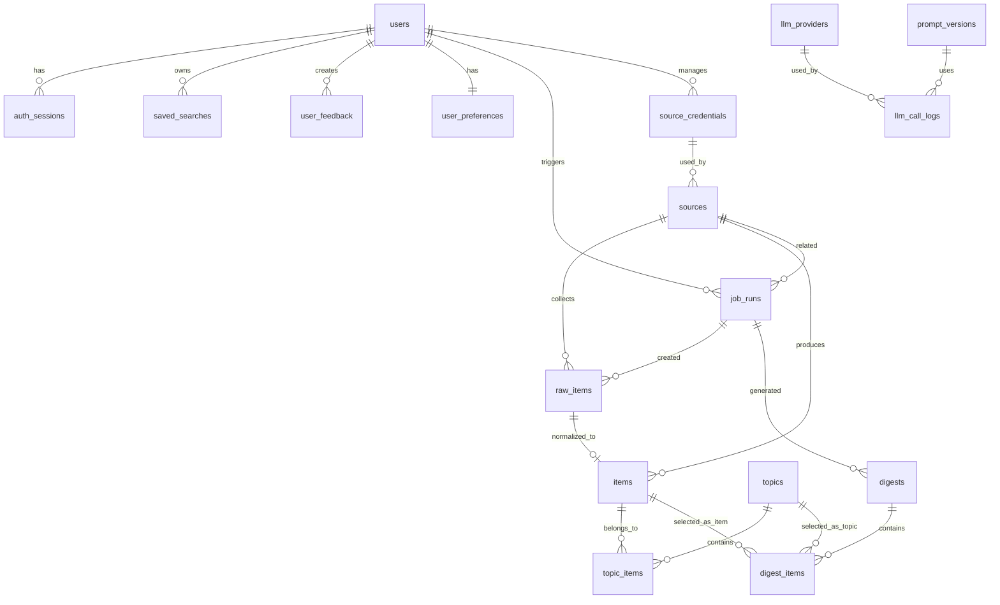

# AI 热点信息每日汇总数据库设计文档

版本：v0.1

日期：2026-09-02

阶段：系统设计

关联文档：

- [系统架构设计](system-architecture.md)
- [API 接口设计](api-design.md)
- [安全设计](security-design.md)

## 1. 设计目标

数据库需要支撑以下能力：

- 多用户账号、会话和管理员创建用户。
- 多来源配置、管理员后台录入的 source token、采集状态和 raw payload 追溯。
- 标准化 item、去重、topic 聚合、评分和中文摘要。
- 每日 digest 快照和历史版本保留。
- 我的关注、保存搜索和用户反馈。
- LLM provider 配置、prompt 版本和调用日志。
- 后台任务状态、失败原因和重跑追踪。
- Digest 调度时间和时区配置。

## 2. 数据库选型

首期使用 PostgreSQL。

原因：

- 适合结构化业务数据和关系查询。
- 支持 JSONB 保存 source 配置、raw payload、score breakdown 和搜索条件。
- 支持 GIN 索引和全文检索，能覆盖 MVP 信息库搜索。
- 后续可接入 pgvector，但 MVP 不依赖 embedding。

## 3. 命名约定

- 表名使用复数蛇形命名，如 `users`、`raw_items`。
- 主键统一使用 UUID。
- 时间字段统一使用 `timestamptz`。
- 枚举值使用英文 code。
- 面向展示的中文名称在前端或配置层映射。
- 敏感值不明文存储；如必须入库，使用应用层加密后保存。

## 3.1 与 DDD 模型的关系

- 数据库表是持久化模型，不直接等同于领域模型。
- SQLAlchemy ORM model 放在 `infrastructure` 层。
- Domain entity 不继承 ORM model，也不依赖数据库 session。
- Repository interface 由 domain/application 定义，repository implementation 由 infrastructure 实现。
- 复杂查询可以通过 query service 或 read model 优化，但跨聚合写入必须由 application use case 编排。

## 4. 枚举定义

### 4.1 用户与权限

| 枚举 | 值 |
| --- | --- |
| `user_role` | `user`, `admin` |
| `user_status` | `active`, `disabled` |

### 4.2 来源与内容

| 枚举 | 值 |
| --- | --- |
| `source_type` | `rss`, `hacker_news`, `github`, `arxiv`, `product_hunt`, `hugging_face` |
| `source_status` | `enabled`, `disabled`, `missing_token`, `error` |
| `credential_status` | `active`, `disabled`, `missing`, `error` |
| `item_status` | `collected`, `normalized`, `deduped`, `ranked`, `summarized`, `selected`, `failed` |
| `category_code` | `model_company`, `open_source`, `research_paper`, `product_launch`, `community`, `industry_funding`, `other` |
| `digest_status` | `generating`, `published`, `failed` |

### 4.3 任务与 LLM

| 枚举 | 值 |
| --- | --- |
| `job_type` | `collect`, `normalize`, `dedupe`, `rank`, `summarize`, `generate_digest`, `publish_digest` |
| `job_status` | `pending`, `running`, `success`, `failed`, `partial_success`, `cancelled` |
| `job_trigger_type` | `scheduled`, `manual`, `retry` |
| `llm_provider_type` | `openai_compatible` |
| `llm_call_status` | `success`, `failed`, `timeout`, `schema_error` |
| `feedback_action` | `more_like`, `less_like`, `block_source` |

## 5. ERD

## 6. 表结构

### 6.1 `users`

用户账号表。系统不提供公开注册，用户只能由管理员创建。

| 字段 | 类型 | 约束 | 说明 |
| --- | --- | --- | --- |
| `id` | uuid | pk | 用户 ID |
| `username` | varchar(64) | unique, not null | 登录名 |
| `email` | varchar(255) | unique | 邮箱 |
| `display_name` | varchar(80) |  | 展示名 |
| `password_hash` | text | not null | 密码哈希 |
| `role` | user_role | not null | `user` 或 `admin` |
| `status` | user_status | not null | 账号状态 |
| `created_by` | uuid | fk users.id | 创建人 |
| `last_login_at` | timestamptz |  | 最近登录时间 |
| `created_at` | timestamptz | not null | 创建时间 |
| `updated_at` | timestamptz | not null | 更新时间 |

索引：

- `ux_users_username`
- `ux_users_email`
- `idx_users_role_status`

### 6.2 `auth_sessions`

会话表。前端只持有随机 session token，数据库保存 token hash。

| 字段 | 类型 | 约束 | 说明 |
| --- | --- | --- | --- |
| `id` | uuid | pk | 会话 ID |
| `user_id` | uuid | fk users.id, not null | 用户 |
| `token_hash` | text | unique, not null | 会话 token 哈希 |
| `ip_hash` | text |  | 登录 IP 哈希 |
| `user_agent` | text |  | User-Agent 摘要 |
| `expires_at` | timestamptz | not null | 过期时间 |
| `revoked_at` | timestamptz |  | 注销时间 |
| `created_at` | timestamptz | not null | 创建时间 |

索引：

- `ux_auth_sessions_token_hash`
- `idx_auth_sessions_user_id`
- `idx_auth_sessions_expires_at`

### 6.3 `sources`

全局信息源配置表，仅管理员可管理。

| 字段 | 类型 | 约束 | 说明 |
| --- | --- | --- | --- |
| `id` | uuid | pk | source ID |
| `name` | varchar(120) | not null | 名称 |
| `type` | source_type | not null | 来源类型 |
| `status` | source_status | not null | 状态 |
| `url` | text |  | RSS URL 或基础 URL |
| `query_config` | jsonb | not null default `{}` | 查询条件 |
| `credential_id` | uuid | fk source_credentials.id | 后台录入的加密凭据 |
| `credential_env_key` | varchar(120) |  | 环境变量密钥别名 |
| `weight` | integer | not null default 50 | 来源权重 |
| `language` | varchar(16) |  | 默认语言 |
| `last_fetched_at` | timestamptz |  | 最近抓取时间 |
| `last_success_at` | timestamptz |  | 最近成功时间 |
| `last_error` | text |  | 最近错误摘要 |
| `created_at` | timestamptz | not null | 创建时间 |
| `updated_at` | timestamptz | not null | 更新时间 |

索引：

- `idx_sources_type_status`
- `idx_sources_status`

### 6.3.1 `source_credentials`

外部 source token 表。管理员可在后台录入，后端加密保存。

| 字段 | 类型 | 约束 | 说明 |
| --- | --- | --- | --- |
| `id` | uuid | pk | credential ID |
| `name` | varchar(120) | not null | 名称 |
| `source_type` | source_type | not null | 适用来源类型 |
| `encrypted_secret` | text | not null | 加密后的 token |
| `secret_masked` | varchar(40) | not null | 前端展示掩码 |
| `status` | credential_status | not null | 状态 |
| `last_test_at` | timestamptz |  | 最近测试时间 |
| `last_test_status` | varchar(32) |  | 最近测试状态 |
| `last_test_error` | text |  | 最近测试错误 |
| `created_by` | uuid | fk users.id | 创建人 |
| `updated_by` | uuid | fk users.id | 更新人 |
| `created_at` | timestamptz | not null | 创建时间 |
| `updated_at` | timestamptz | not null | 更新时间 |

约束：

- `encrypted_secret` 永不返回前端。
- 删除 credential 前需要检查是否仍被 source 使用。

### 6.4 `raw_items`

原始采集数据表，用于追溯和重复采集判断。

| 字段 | 类型 | 约束 | 说明 |
| --- | --- | --- | --- |
| `id` | uuid | pk | raw item ID |
| `source_id` | uuid | fk sources.id, not null | 来源 |
| `job_run_id` | uuid | fk job_runs.id | 采集任务 |
| `source_type` | source_type | not null | 来源类型快照 |
| `external_id` | varchar(255) |  | 外部平台 ID |
| `url` | text | not null | 原文 URL |
| `canonical_url` | text |  | 归一化 URL |
| `title` | text | not null | 原始标题 |
| `author` | text |  | 作者 |
| `published_at` | timestamptz |  | 发布时间 |
| `fetched_at` | timestamptz | not null | 抓取时间 |
| `raw_hash` | varchar(64) | not null | raw payload hash |
| `raw_payload` | jsonb | not null | 原始响应 |
| `status` | item_status | not null | 处理状态 |
| `error_message` | text |  | 错误摘要 |
| `created_at` | timestamptz | not null | 创建时间 |

约束与索引：

- `ux_raw_items_source_external_id`：`source_id + external_id` 唯一，external_id 为空时不参与。
- `ux_raw_items_source_raw_hash`：`source_id + raw_hash` 唯一。
- `idx_raw_items_source_fetched_at`
- `idx_raw_items_status`

### 6.5 `items`

标准化内容表。信息库主要查询该表。

| 字段 | 类型 | 约束 | 说明 |
| --- | --- | --- | --- |
| `id` | uuid | pk | item ID |
| `source_id` | uuid | fk sources.id, not null | 来源 |
| `raw_item_id` | uuid | fk raw_items.id | 原始条目 |
| `external_id` | varchar(255) |  | 外部 ID |
| `title` | text | not null | 标题 |
| `normalized_title` | text | not null | 归一化标题 |
| `title_hash` | varchar(64) | not null | 标题 hash |
| `url` | text | not null | 原文 URL |
| `canonical_url` | text |  | 归一化 URL |
| `summary_original` | text |  | 原始摘要 |
| `content_snippet` | text |  | 正文片段 |
| `language` | varchar(16) |  | 原文语言 |
| `category` | category_code | not null default `other` | 来源规则分类 |
| `tags` | text[] | not null default `{}` | 标签 |
| `metrics` | jsonb | not null default `{}` | 来源热度指标 |
| `published_at` | timestamptz |  | 发布时间 |
| `collected_at` | timestamptz | not null | 入库时间 |
| `status` | item_status | not null | 处理状态 |
| `score` | numeric(6,2) | not null default 0 | 全局分 |
| `score_breakdown` | jsonb | not null default `{}` | 评分解释 |
| `summary_zh` | text |  | 中文摘要 |
| `importance_zh` | text |  | 为什么重要 |
| `summary_confidence` | numeric(4,3) |  | 摘要置信度 |
| `summarized_at` | timestamptz |  | 摘要时间 |
| `llm_provider_id` | uuid | fk llm_providers.id | 摘要 provider |
| `llm_model` | varchar(120) |  | 摘要模型快照 |
| `prompt_version` | varchar(64) |  | prompt 版本 |
| `error_message` | text |  | 处理错误 |
| `created_at` | timestamptz | not null | 创建时间 |
| `updated_at` | timestamptz | not null | 更新时间 |

约束与索引：

- `ux_items_source_external_id`：`source_id + external_id` 唯一，external_id 为空时不参与。
- `idx_items_canonical_url`
- `idx_items_title_hash`
- `idx_items_status_category`
- `idx_items_source_published_at`
- `idx_items_score_published_at`
- `idx_items_tags_gin`
- `idx_items_search_tsv`：标题、中文摘要、原始摘要全文检索；标签通过 `idx_items_tags_gin` 检索。

### 6.6 `topics`

专题聚合表。MVP 不做独立热点专题页，但 digest 卡片和详情抽屉会使用。

| 字段 | 类型 | 约束 | 说明 |
| --- | --- | --- | --- |
| `id` | uuid | pk | topic ID |
| `title` | text | not null | 专题标题 |
| `normalized_key` | varchar(128) | not null | 聚合 key |
| `category` | category_code | not null default `other` | 主条目来源规则分类 |
| `tags` | text[] | not null default `{}` | 标签 |
| `summary_zh` | text |  | 专题摘要 |
| `importance_zh` | text |  | 为什么重要 |
| `score` | numeric(6,2) | not null default 0 | 专题分 |
| `source_count` | integer | not null default 0 | 来源数 |
| `primary_item_id` | uuid | fk items.id | 主条目 |
| `first_seen_at` | timestamptz | not null | 首次出现 |
| `last_seen_at` | timestamptz | not null | 最近更新 |
| `created_at` | timestamptz | not null | 创建时间 |
| `updated_at` | timestamptz | not null | 更新时间 |

索引：

- `idx_topics_score_last_seen`
- `idx_topics_category`
- `ux_topics_normalized_key`：专题聚合键唯一，保证并发 Worker 不重复创建专题

### 6.7 `topic_items`

topic 与 item 的关系表。

| 字段 | 类型 | 约束 | 说明 |
| --- | --- | --- | --- |
| `topic_id` | uuid | fk topics.id, not null | topic |
| `item_id` | uuid | fk items.id, not null | item |
| `relation_type` | varchar(32) | not null default `related` | 关系类型 |
| `is_primary` | boolean | not null default false | 是否主来源 |
| `created_at` | timestamptz | not null | 创建时间 |

主键：

- `topic_id + item_id`

### 6.8 `digests`

每日简报表。按日期和版本保留快照。

| 字段 | 类型 | 约束 | 说明 |
| --- | --- | --- | --- |
| `id` | uuid | pk | digest ID |
| `digest_date` | date | not null | 简报日期 |
| `version` | integer | not null | 当日版本号 |
| `status` | digest_status | not null | 状态 |
| `title` | text | not null | 简报标题 |
| `overview_zh` | text |  | 今日概览 |
| `stats` | jsonb | not null default `{}` | 条目数、专题数、来源数 |
| `job_run_id` | uuid | fk job_runs.id | 生成任务 |
| `generated_at` | timestamptz |  | 生成时间 |
| `published_at` | timestamptz |  | 发布时间 |
| `created_at` | timestamptz | not null | 创建时间 |

约束与索引：

- `ux_digests_date_version`：`digest_date + version` 唯一。
- `idx_digests_date_status`

### 6.9 `digest_items`

digest 快照条目表。为了保证历史简报稳定，保留标题、摘要、分数等快照字段。

| 字段 | 类型 | 约束 | 说明 |
| --- | --- | --- | --- |
| `id` | uuid | pk | 记录 ID |
| `digest_id` | uuid | fk digests.id, not null | digest |
| `item_id` | uuid | fk items.id | 单条内容 |
| `topic_id` | uuid | fk topics.id | 专题 |
| `item_type` | varchar(16) | not null | `item` 或 `topic` |
| `rank` | integer | not null | 排名 |
| `score_snapshot` | numeric(6,2) | not null | 分数快照 |
| `title_snapshot` | text | not null | 标题快照 |
| `summary_snapshot_zh` | text |  | 摘要快照 |
| `importance_snapshot_zh` | text |  | 重要性快照 |
| `category_snapshot` | category_code | not null | 来源规则分类快照 |
| `source_snapshot` | jsonb | not null default `{}` | 来源快照 |
| `created_at` | timestamptz | not null | 创建时间 |

约束与索引：

- `ux_digest_items_digest_rank`
- `idx_digest_items_digest_id`
- check：`item_id` 和 `topic_id` 必须且只能有一个非空。

### 6.10 `user_preferences`

用户个性化配置表。

| 字段 | 类型 | 约束 | 说明 |
| --- | --- | --- | --- |
| `user_id` | uuid | pk, fk users.id | 用户 |
| `follow_keywords` | text[] | not null default `{}` | 关注关键词，软加权 |
| `exclude_keywords` | text[] | not null default `{}` | 排除关键词，硬过滤 |
| `follow_categories` | category_code[] | not null default `{}` | 默认筛选和轻量加权 |
| `follow_source_types` | source_type[] | not null default `{}` | 默认筛选 |
| `disabled_source_types` | source_type[] | not null default `{}` | 关闭来源类型，硬过滤 |
| `blocked_source_ids` | uuid[] | not null default `{}` | 屏蔽来源 |
| `blocked_domains` | text[] | not null default `{}` | 屏蔽域名 |
| `weights` | jsonb | not null default `{}` | 个性化权重配置 |
| `created_at` | timestamptz | not null | 创建时间 |
| `updated_at` | timestamptz | not null | 更新时间 |

索引：

- `idx_user_preferences_keywords_gin`

### 6.11 `saved_searches`

用户保存的站内搜索条件。

| 字段 | 类型 | 约束 | 说明 |
| --- | --- | --- | --- |
| `id` | uuid | pk | 保存搜索 ID |
| `user_id` | uuid | fk users.id, not null | 用户 |
| `name` | varchar(120) | not null | 规则名称 |
| `query` | jsonb | not null | 站内搜索条件 |
| `enabled` | boolean | not null default true | 是否启用 |
| `apply_as_filter` | boolean | not null default true | 是否作为默认筛选 |
| `apply_as_boost` | boolean | not null default true | 是否参与加权 |
| `created_at` | timestamptz | not null | 创建时间 |
| `updated_at` | timestamptz | not null | 更新时间 |

约束：

- `query` 只能包含站内字段，如 keyword、source_id、source_type、category、status、time_range、sort。
- 不允许保存外部 URL 或外部实时检索配置。

### 6.12 `user_feedback`

用户反馈记录。

| 字段 | 类型 | 约束 | 说明 |
| --- | --- | --- | --- |
| `id` | uuid | pk | 反馈 ID |
| `user_id` | uuid | fk users.id, not null | 用户 |
| `item_id` | uuid | fk items.id | item |
| `topic_id` | uuid | fk topics.id | topic |
| `source_id` | uuid | fk sources.id | 屏蔽来源时使用 |
| `action` | feedback_action | not null | 反馈动作 |
| `reason_tags` | text[] | not null default `{}` | 提取出的偏好标签 |
| `created_at` | timestamptz | not null | 创建时间 |

索引：

- `idx_user_feedback_user_action`
- `idx_user_feedback_item`
- `idx_user_feedback_topic`

### 6.13 `llm_providers`

LLM provider 配置表，仅管理员可管理。

| 字段 | 类型 | 约束 | 说明 |
| --- | --- | --- | --- |
| `id` | uuid | pk | provider ID |
| `name` | varchar(120) | unique, not null | 名称 |
| `type` | llm_provider_type | not null | provider 类型 |
| `base_url` | text | not null | OpenAI-compatible base URL |
| `model` | varchar(120) | not null | 默认模型 |
| `encrypted_api_key` | text |  | 加密后的 API key |
| `api_key_masked` | varchar(40) |  | 前端展示用掩码 |
| `timeout_seconds` | integer | not null default 60 | 超时 |
| `retry_count` | integer | not null default 2 | 重试次数 |
| `enabled` | boolean | not null default true | 是否启用 |
| `is_default` | boolean | not null default false | 是否默认 |
| `last_test_at` | timestamptz |  | 最近测试时间 |
| `last_test_status` | varchar(32) |  | 最近测试状态 |
| `last_test_error` | text |  | 最近测试错误 |
| `created_at` | timestamptz | not null | 创建时间 |
| `updated_at` | timestamptz | not null | 更新时间 |

约束：

- 同一时间最多一个 provider `is_default = true`。
- `encrypted_api_key` 不返回给前端。

### 6.14 `prompt_versions`

Prompt 版本表。

| 字段 | 类型 | 约束 | 说明 |
| --- | --- | --- | --- |
| `id` | uuid | pk | prompt ID |
| `name` | varchar(120) | not null | prompt 名称 |
| `version` | varchar(64) | not null | 版本号 |
| `template` | text | not null | 模板 |
| `output_schema` | jsonb | not null | 输出 schema |
| `enabled` | boolean | not null default true | 是否启用 |
| `created_at` | timestamptz | not null | 创建时间 |

约束：

- `name + version` 唯一。

### 6.15 `llm_call_logs`

LLM 调用日志表。

| 字段 | 类型 | 约束 | 说明 |
| --- | --- | --- | --- |
| `id` | uuid | pk | 日志 ID |
| `provider_id` | uuid | fk llm_providers.id | provider |
| `prompt_version_id` | uuid | fk prompt_versions.id | prompt |
| `object_type` | varchar(32) | not null | `item`、`topic`、`digest` |
| `object_id` | uuid | not null | 业务对象 ID |
| `model` | varchar(120) | not null | 模型快照 |
| `status` | llm_call_status | not null | 调用状态 |
| `input_tokens` | integer |  | 输入 token |
| `output_tokens` | integer |  | 输出 token |
| `latency_ms` | integer |  | 耗时 |
| `error_message` | text |  | 错误摘要 |
| `created_at` | timestamptz | not null | 创建时间 |

索引：

- `idx_llm_call_logs_object`
- `idx_llm_call_logs_provider_status`

### 6.16 `job_runs`

后台任务记录表。

| 字段 | 类型 | 约束 | 说明 |
| --- | --- | --- | --- |
| `id` | uuid | pk | job ID |
| `job_type` | job_type | not null | 任务类型 |
| `trigger_type` | job_trigger_type | not null | 触发方式 |
| `status` | job_status | not null | 状态 |
| `source_id` | uuid | fk sources.id | 关联 source |
| `parent_job_run_id` | uuid | fk job_runs.id | 重跑来源 |
| `created_by` | uuid | fk users.id | 手动触发人 |
| `params` | jsonb | not null default `{}` | 任务参数 |
| `total_count` | integer | not null default 0 | 总数 |
| `success_count` | integer | not null default 0 | 成功数 |
| `failure_count` | integer | not null default 0 | 失败数 |
| `error_message` | text |  | 错误摘要 |
| `error_detail` | jsonb |  | 错误详情 |
| `started_at` | timestamptz |  | 开始时间 |
| `ended_at` | timestamptz |  | 结束时间 |
| `created_at` | timestamptz | not null | 创建时间 |

索引：

- `idx_job_runs_type_status`
- `idx_job_runs_started_at`
- `idx_job_runs_source_id`

### 6.16.1 `scheduler_configs`

调度配置表。Digest 默认北京时间每天 08:00 生成，管理员可修改。

| 字段 | 类型 | 约束 | 说明 |
| --- | --- | --- | --- |
| `id` | uuid | pk | 配置 ID |
| `job_type` | job_type | not null | 任务类型 |
| `name` | varchar(120) | not null | 配置名称 |
| `cron_expression` | varchar(120) | not null | cron 表达式 |
| `timezone` | varchar(64) | not null default `Asia/Shanghai` | 时区 |
| `enabled` | boolean | not null default true | 是否启用 |
| `params` | jsonb | not null default `{}` | 任务参数 |
| `created_by` | uuid | fk users.id | 创建人 |
| `updated_by` | uuid | fk users.id | 更新人 |
| `created_at` | timestamptz | not null | 创建时间 |
| `updated_at` | timestamptz | not null | 更新时间 |

默认 seed：

- `job_type = generate_digest`
- `cron_expression = 0 8 * * *`
- `timezone = Asia/Shanghai`

## 7. 核心查询设计

### 7.1 今日简报

查询条件：

- `digests.digest_date = today`
- `digests.status = published`
- 取最大 `version`
- 按 `digest_items.rank` 升序

### 7.2 历史简报

查询条件：

- `digests.digest_date = 指定日期`
- 默认取最新 published version
- 筛选只作用于该 digest 的 `digest_items`

### 7.3 信息库

查询条件：

- 主表 `items`
- 支持 keyword、source_id、source_type、category、status、published_at range
- 默认排序 `score desc, published_at desc`
- 关键词使用 PostgreSQL 全文检索；MVP 可叠加 `ILIKE` 兜底。

### 7.4 我的关注

处理方式：

- 先查询页面基础结果。
- 根据 `user_preferences` 和 `saved_searches` 应用硬过滤和默认筛选。
- 根据关键词、分类和反馈记录计算临时 `user_score`。
- 不把 `user_score` 写回 `items`，避免影响其他用户。

## 8. 数据保留与清理

已确认默认策略：

- `raw_items` 保留 180 天。
- `items` 和 `digests` 长期保留。
- `topics` 长期保留。
- `llm_call_logs` 保留 180 天。
- `job_runs` 保留 180 天。
- `auth_sessions` 过期 30 天后清理。
- PostgreSQL 每日备份一次，默认保留 14 天。

## 9. 迁移策略

- 所有表结构通过 Alembic migration 管理。
- 初始 migration 创建枚举、表、索引和约束。
- 提供一次性 `create-admin` 命令创建首个管理员账号。
- 初始化脚本创建默认 prompt version。
- 默认 source 清单单独使用 seed 脚本导入，避免写死在 migration 中。
- 默认 source seed 详见 [系统设计决策记录](design-decisions.md)。
