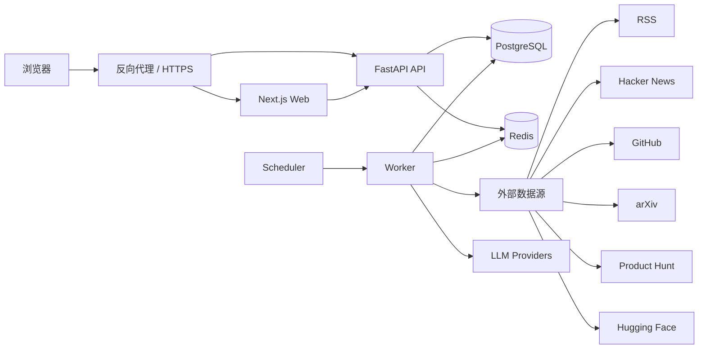
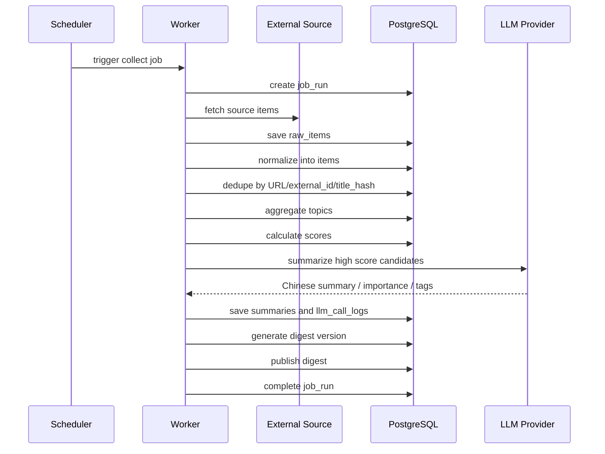

# AI 热点信息每日汇总系统架构设计文档

版本：v0.1

日期：2026-09-02

阶段：系统设计

关联文档：

- [需求说明书](../requirements/requirements-specification.md)
- [PRD](../product/prd.md)
- [产品原型](../product/product-prototype.md)
- [页面流程](../product/page-flow.md)
- [后端 DDD 设计](backend-ddd-design.md)
- [数据库设计](database-design.md)
- [API 接口设计](api-design.md)
- [安全设计](security-design.md)

## 1. 设计目标

系统架构需要支撑一个外公网部署的多用户 AI 情报聚合 Web 看板：

- 自动采集多来源 AI 信息。
- 对原始信息进行标准化、去重、轻量 topic 聚合、评分和中文摘要。
- 自动生成并发布每日 digest 到 Web 看板。
- 支持普通用户查看今日简报、历史简报、信息库、详情和我的关注。
- 支持管理员管理用户、来源、任务和 LLM provider。
- 通过统一 collector 和 LLM provider 抽象降低后续扩展成本。

## 2. 总体架构



首期采用单仓库、多进程部署：

- `web`：Next.js 前端应用。
- `api`：FastAPI 后端 API 服务。
- `worker`：采集、处理、摘要、digest 生成任务进程。
- `scheduler`：定时触发任务，可与 worker 同镜像不同启动命令。
- `postgres`：主业务数据库。
- `redis`：任务锁、轻量队列、缓存和限流计数。
- `reverse-proxy`：HTTPS、静态资源转发、API 转发。

## 3. 技术选型

| 层级 | 选型 | 说明 |
| --- | --- | --- |
| 前端 | Next.js + TypeScript | Web 看板、路由、页面状态管理 |
| 后端 | FastAPI + Python + DDD 模块化单体 | API、认证、业务编排、管理后台接口 |
| ORM/迁移 | SQLAlchemy + Alembic | 数据模型、迁移版本管理 |
| 数据库 | PostgreSQL | 结构化数据、JSONB、全文检索、索引能力 |
| 缓存/任务状态 | Redis | 分布式锁、缓存、限流和后台任务状态 |
| 调度 | APScheduler 起步 | MVP 定时任务，后续可替换 Celery Beat 或 Dramatiq |
| 后台任务 | Python Worker | collector、摘要、评分、digest 生成 |
| 部署 | Docker Compose | 本地和单台云服务器部署一致 |
| 反向代理 | Caddy / Nginx | HTTPS、路由转发、安全响应头；MVP 推荐 Caddy 简化证书签发 |

## 4. 服务边界

### 4.1 Web 服务

职责：

- 登录页、今日简报、历史简报、信息库、我的关注和管理员页面。
- 通过后端 API 获取数据。
- 根据当前用户角色展示导航。
- 不保存 LLM key、source token 等敏感信息。
- 不直接访问外部数据源。

### 4.2 API 服务

职责：

- 认证、会话、角色权限。
- 内容查询、详情查询、个性化视图计算。
- 管理员 source、job、LLM provider、用户管理接口。
- 输入校验、权限校验和错误响应统一处理。
- 触发后台任务，但不在请求线程中执行长任务。

### 4.3 Worker 服务

职责：

- 从启用 source 拉取原始内容。
- 标准化 raw item。
- 去重、聚合 topic、计算 score。
- 调用 LLM provider 生成中文摘要、标签和“为什么重要”。
- 生成和发布每日 digest。
- 写入 job run、错误详情和处理状态。

### 4.4 Scheduler 服务

职责：

- 按配置触发采集任务。
- 按配置触发摘要和 digest 生成任务。
- 使用 Redis 锁避免同类任务并发重复执行。

首期可以将 scheduler 和 worker 放在同一个进程中运行；生产部署建议拆成两个进程，避免长任务阻塞调度。

## 5. 后端 DDD 模块划分

```text
api/
├── app/
│   ├── main.py
│   ├── bootstrap/                  # 应用启动、依赖注入、路由注册
│   ├── shared/                     # 通用领域基类、配置、事务、日志、错误映射
│   ├── identity_access/            # 用户、登录、会话、角色权限
│   ├── source_management/          # source 管理和采集配置
│   ├── ingestion/                  # collector、raw item 入库、采集任务入口
│   ├── content_intelligence/       # item、topic、去重、评分、摘要
│   ├── digest_publishing/          # digest 生成、版本、发布、历史快照
│   ├── personalization/            # 我的关注、保存搜索、用户反馈、user score
│   ├── llm_operations/             # provider、prompt、调用日志
│   └── job_operations/             # job run、重跑、任务状态
└── alembic/
```

每个 bounded context 内部按 DDD 分层：

```text
<bounded_context>/
├── domain/           # Entity、Value Object、Aggregate、Domain Service、Repository Interface
├── application/      # Use Case、Command、Query、事务编排
├── infrastructure/   # ORM、Repository 实现、外部 API adapter、Redis、加密
└── interfaces/       # FastAPI router、HTTP schema、后台任务入口
```

依赖原则：

- `domain` 不依赖 FastAPI、SQLAlchemy、Redis 或外部 SDK。
- `application` 编排 use case，并通过接口依赖 repository、collector 和 LLM provider。
- `infrastructure` 实现 repository、collector、LLM provider、Redis lock 等技术细节。
- `interfaces` 只做协议适配、鉴权、参数校验和 DTO 转换。
- SQLAlchemy ORM model 不等同于领域实体，ORM 放在 infrastructure 层。
- collector 只负责外部数据获取和初步映射，不直接生成 digest。
- LLM 调用通过 provider port，不在摘要业务中写死模型厂商。

详细说明见：[后端 DDD 设计](backend-ddd-design.md)。

## 6. 前端模块划分

```text
web/
├── app/
│   ├── login/
│   ├── today/
│   ├── history/
│   ├── library/
│   ├── following/
│   └── admin/
│       ├── sources/
│       ├── jobs/
│       ├── llm/
│       └── users/
├── components/
│   ├── layout/
│   ├── digest/
│   ├── library/
│   ├── following/
│   └── admin/
├── lib/
│   ├── api-client.ts
│   ├── auth.ts
│   └── types.ts
└── styles/
```

前端原则：

- 所有业务数据通过 `/api/v1` 读取。
- 普通用户不渲染管理员导航。
- 管理页面仍依赖后端权限校验，不能只靠前端隐藏。
- 信息库搜索只请求站内内容查询 API。

## 7. 数据处理流程



## 8. Collector 抽象

统一接口：

```text
Collector.collect(source, since) -> list[RawCollectedItem]
```

统一返回字段：

- `source_id`
- `source_type`
- `external_id`
- `title`
- `url`
- `canonical_url`
- `author`
- `published_at`
- `summary_original`
- `content_snippet`
- `metrics`
- `raw_payload`

首期 collector：

| 类型 | 主要输入 | 关键风险 |
| --- | --- | --- |
| RSS | feed URL | feed 结构差异、编码问题 |
| Hacker News | query、tag、时间范围 | rate limit、重复讨论 |
| GitHub | query、语言、star 阈值 | rate limit、Search API 结果波动 |
| arXiv | query、分类、时间范围 | 分类映射、论文摘要较长 |
| Product Hunt | topic、日期范围 | token、授权和 rate limit |
| Hugging Face | model/dataset/space 查询 | API 变化、热度指标口径 |

## 9. LLM Provider 抽象

统一接口：

```text
LLMProvider.generate_json(prompt, schema, options) -> LLMResult
```

首期 provider 类型：

- `openai_compatible`

配置项：

- `name`
- `base_url`
- `model`
- `api_key`
- `timeout_seconds`
- `retry_count`
- `enabled`
- `is_default`

调用要求：

- 输出必须按 JSON schema 校验。
- 调用结果记录 provider、model、prompt version、token 用量、耗时和错误。
- provider 失败时记录失败；如配置了备用 provider，可重试备用 provider。
- 摘要失败不能伪装成功，item 状态应明确标记。

## 10. 个性化计算

系统先计算 `global_score`，再按当前用户规则计算 `user_score`。

执行顺序：

1. 取页面基础数据范围。
2. 应用硬过滤：排除关键词、屏蔽来源、关闭来源类型。
3. 应用默认筛选：关注分类、关注来源类型、保存搜索条件。
4. 应用软加权：关注关键词、关注分类、多看类似、少看类似。
5. 返回按 `user_score` 排序的结果。

该逻辑只影响当前用户视图，不修改全局 digest 和全局 score。

## 11. 任务与并发策略

- 每类任务写入 `job_runs`。
- 定时任务使用 Redis lock，锁 key 包含任务类型和日期。
- Digest 默认北京时间每天 08:00 生成。
- 调度时间保存为 cron 表达式和时区，可由管理员修改。
- 手动重跑会创建新的 job run，不覆盖历史记录。
- 单个 source 失败只标记该 source 的 job 失败，不中断其他 source。
- digest 生成使用版本号，历史 digest 默认读取最新已发布版本。
- 同一天重新生成 digest 时，新建 version，保留旧版本快照。

## 12. 部署拓扑

生产部署已确定为单台云服务器。由于系统面向外公网，必须使用 HTTPS 反向代理；反向代理负责 TLS 证书、HTTP 到 HTTPS 跳转、Web/API 路由转发和基础安全响应头。

```text
公网
  |
  v
Reverse Proxy :443
  |-- /          -> web:3000
  |-- /api/v1    -> api:8000
  |
私有 Docker 网络
  |-- postgres:5432
  |-- redis:6379
  |-- worker
  |-- scheduler
```

部署约束：

- 生产环境必须启用 HTTPS，不能直接以 HTTP 暴露登录和业务接口。
- PostgreSQL 和 Redis 不暴露公网端口。
- API 只通过反向代理暴露。
- 所有生产环境 cookie 必须启用 `Secure` 和 `HttpOnly`。
- 环境变量和密钥不提交仓库。

## 13. MVP 实施顺序

1. 建立仓库结构、Docker Compose、基础配置。
2. 实现数据库迁移、用户、会话和一次性 `create-admin` 管理员初始化命令。
3. 实现 source、job、LLM provider 管理接口。
4. 实现默认 source seed 和 RSS/HN/GitHub/arXiv/Product Hunt/Hugging Face collector 的最小可用版本。
5. 实现 raw item、item、去重、评分和 topic 聚合。
6. 实现中文摘要和 digest 生成。
7. 实现 Web 看板页面。
8. 实现我的关注和个性化排序。
9. 补齐测试、部署和监控。

## 14. 已确认默认值

- 首个管理员账号通过一次性 `create-admin` 命令创建。
- 默认 source 初始化清单每类预置 1-3 个最小可用配置，详见 [系统设计决策记录](design-decisions.md)。
- 数据保留周期：`raw_items`、`llm_call_logs`、`job_runs` 保留 180 天，核心 `items`、`topics`、`digests` 长期保留。
- 数据库备份周期：每日备份一次，默认保留 14 天。
