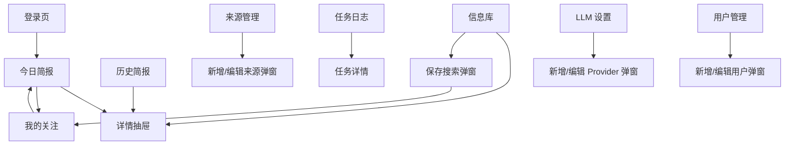
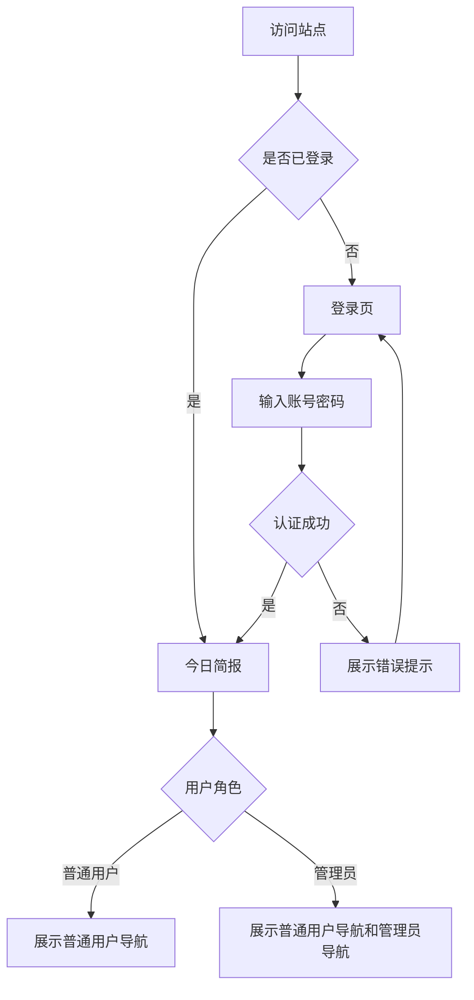
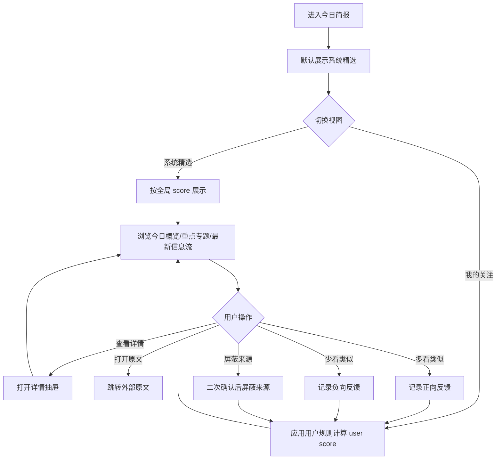
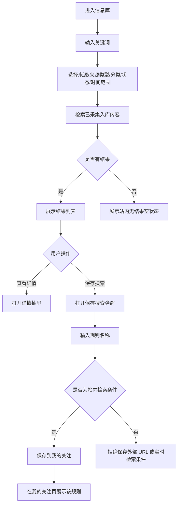
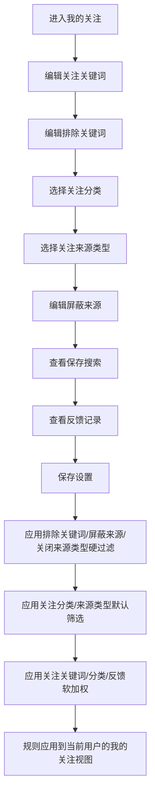
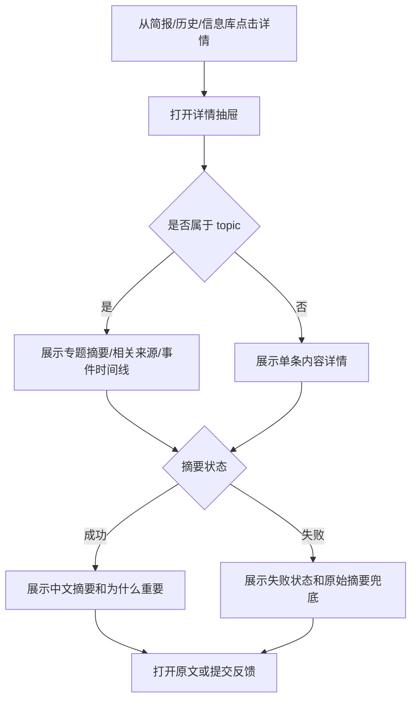
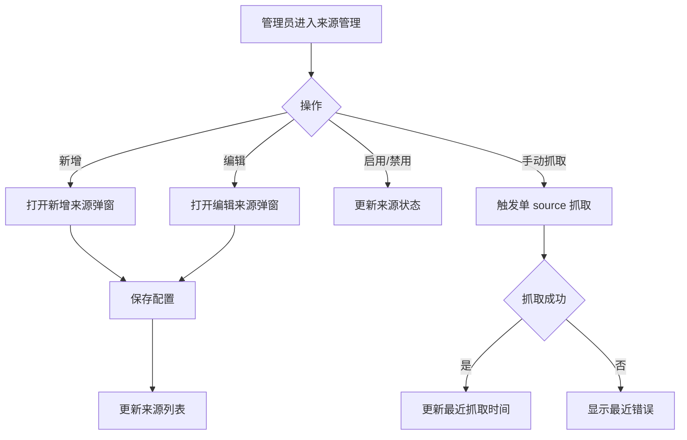
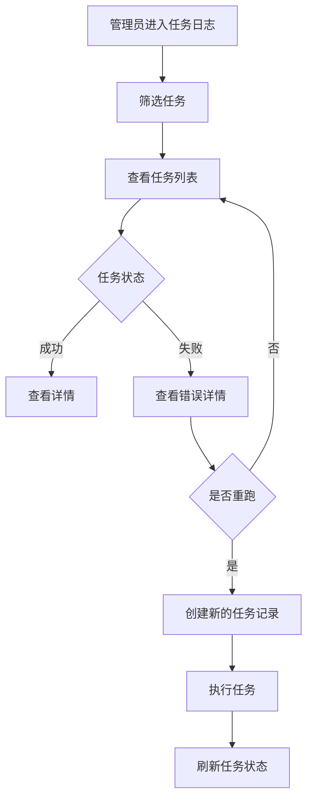
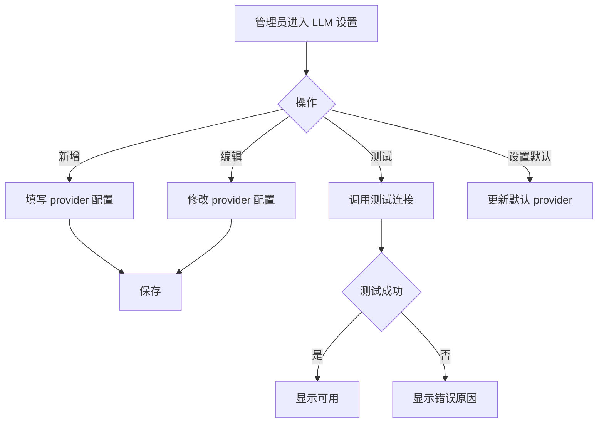
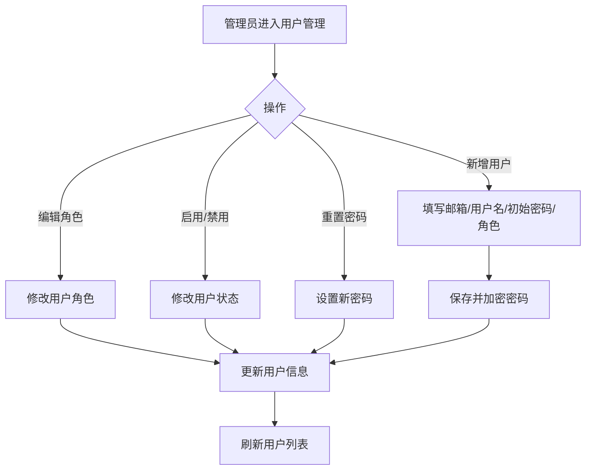

# AI 热点信息每日汇总系统页面流程

版本：v0.2

日期：2026-09-01

阶段：产品设计

关联文档：

- [PRD](prd.md)
- [产品原型](product-prototype.md)

## 1. 页面地图

## 2. 登录与访问流程

## 3. 今日简报浏览流程

## 4. 信息库搜索与保存搜索流程

## 5. 我的关注配置流程

## 6. 详情抽屉流程

## 7. 管理员来源管理流程

## 8. 管理员任务流程

## 9. 管理员配置 LLM 流程

## 10. 管理员用户管理流程

