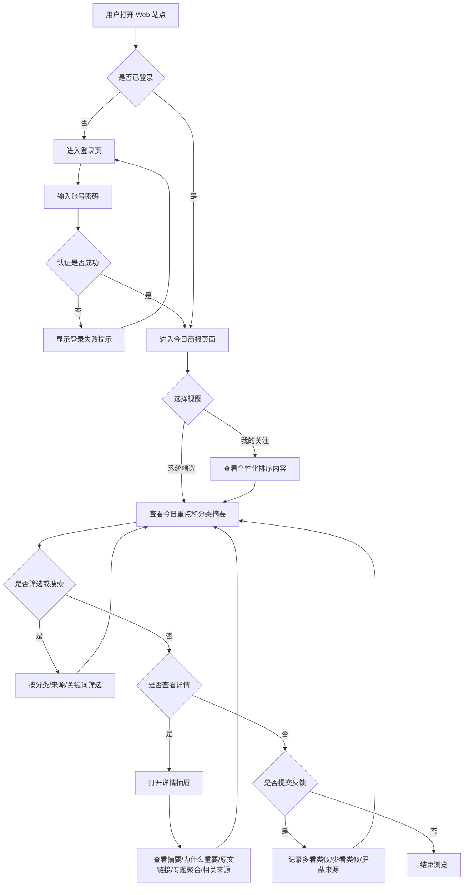
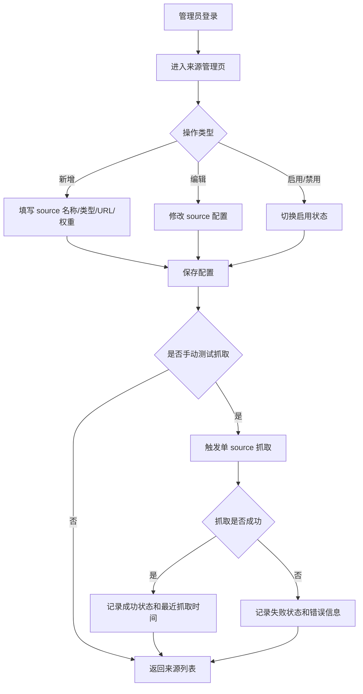
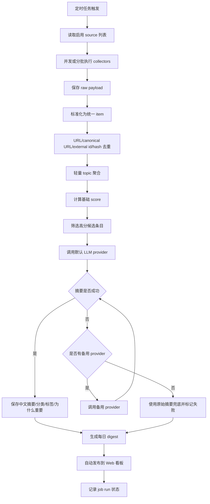
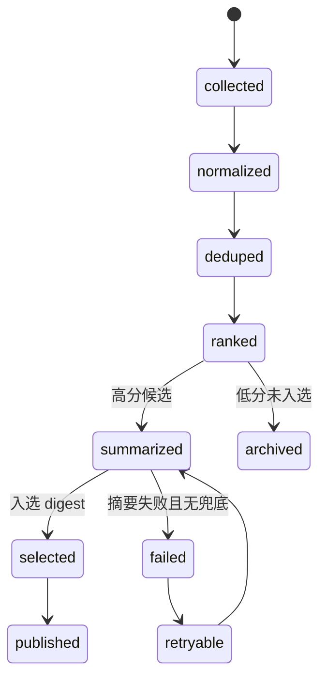
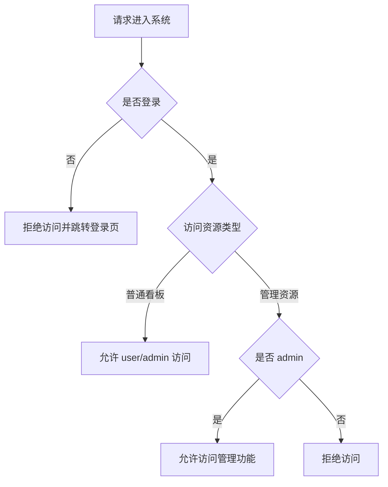
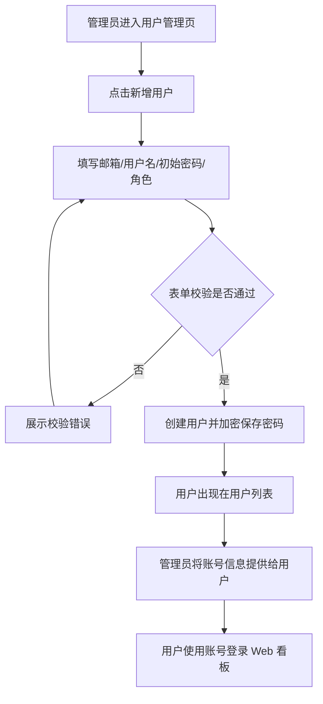
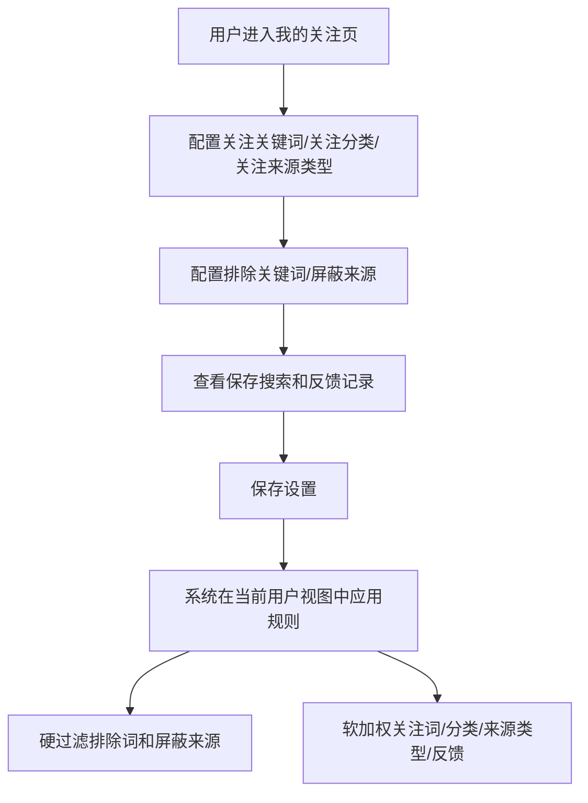
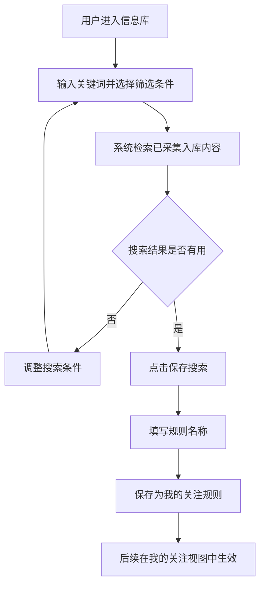
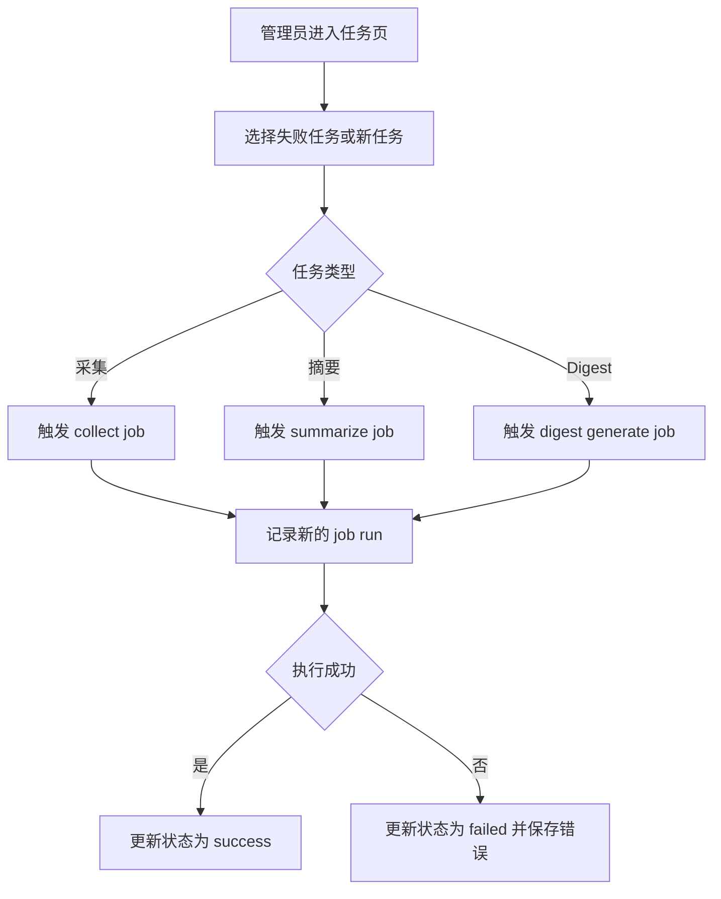

# AI 热点信息每日汇总系统业务流程图

版本：v0.2

日期：2026-09-01

关联文档：

- [需求说明书](requirements-specification.md)

## 1. 用户查看 Web 看板流程

## 2. 管理员维护信息源流程

## 3. 系统自动生成每日 Digest 流程

## 4. 条目处理状态流

## 5. 角色权限流程

## 6. 管理员创建用户流程

## 7. 用户配置我的关注流程

## 8. 用户站内搜索并保存流程

## 9. 管理员手动重跑流程

